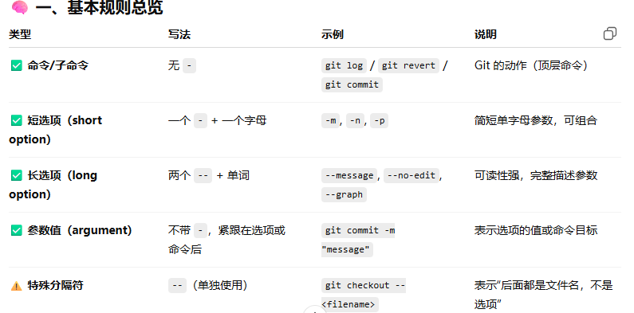

# Git

命令规则

git init //初始化仓库 

git add //添加至暂存处

git commit -m "简单摘要" //将更改提交至存储库

git push //更新远程仓库使其与本地仓库同步

git pull //更新本地仓库 使其与远程仓库同步

git remote add origin https://github.com/<你的用户名>/<仓库名>.git  //关联远程仓库

git remote -v //查看当前绑定的远程仓库

git branch -M main  //指定分支

git remote set-url origin <读用的URL>  //更改设置远程仓库url

### git log 

#### git log [选项] [范围]

git log //默认打印所在分支的日志

git log main //打印main分支的log

git log --oneline  //美国提交一行显示

git log -n  //只显示前n行数据

### git revert

git revert head     //撤销最近一次提交，文件会自动修改为上一次提交的状态。

git revert <commit_hash>   //撤销某次特定提交，立即提交。

git revert -n <commit_hash>  //撤销这次提交的改动，但不要马上提交，我想先看一看再手动提交。

### git reset
