基本数据类型：直接存储数据的值 //int char boolean

引用数据类型：存储数据对象在堆内存中的地址 //数组 String

## java-文件

创建文件对象：最常用的是传递url参数创建

一些方法：

isFile？isDiertory？length

mkdir：创建文件夹 且是一级文件夹

mkdirs：可以创建多级文件夹。

createFile：创建文件

delete：删除文件或空文件夹，使用delete执行删除方法之后，会直接删除，不会进回收站。

File提供了两种遍历**文件夹**的方法，第一种方法list返回一个数组，其中包含所有一级文件夹，文件的名字。第二种方式listFiles返回一个File的数组，其将每一个一级文件夹，文件的对象封装进去了。

如何得到一个文件夹里所有的内容呢？

使用递归算法，一层层遍历。

## IO流

### 体系

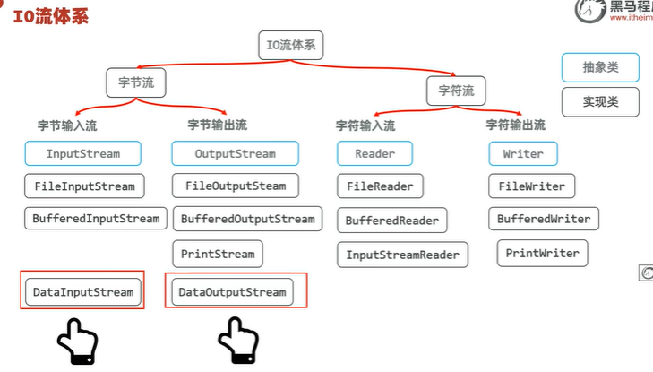

为什么使用字节流时使用数组传递和接受数据，而不用列表？

1.数组在内存中是连续的，文件的字节也是连续的。

2列表中的数据实际是目标类的封装类，开销更大。

3.因为列表是基于数组，列表长度可变性，动态扩容也是基于数组，使用列表多了一层包装，来回就是两层。


Tip：在进行io流时，用来接受的字节数组越大 效率越高。不过越大，效率的提升越来越有限，甚至适得其反。

### 输入流 输出流 

字节输入流 字节输出流 字符输入流 字符输入流


#### 字节流


字节输入流：将磁盘中的字节传输到内存中

构造器：

FileInputStream


字节输出流：将数据写入磁盘

构造器：

FileOutputStream


#### 字符流


文件字符输入流

FileReader


文件字符输出流

FileWriter


tip：

字符输出流为什么需要flush？

因为频繁的磁盘 I/O 操作很慢，加入缓冲区之后可以减少写入磁盘的次数，提高效率，缺点是需要flush刷新，将缓存区的字符赶紧写入磁盘。

flush：刷新字符流 close 关闭包含了刷新


字符输入转换流

InputStreamReader


### 其他流

打印流

PrintStream PrintWriter


特殊数据流

DataOutputStream：特殊数据输出流，允许把数据和类型都写出去

DataOutputStream：特殊数据输入流，允许按照类型读数据


Tips:

使用try-catch-finally方法时 遇到需要释放资源的情况 比如通信管道的释放，字节流管道的释放，可以使用try-with-resource方法。

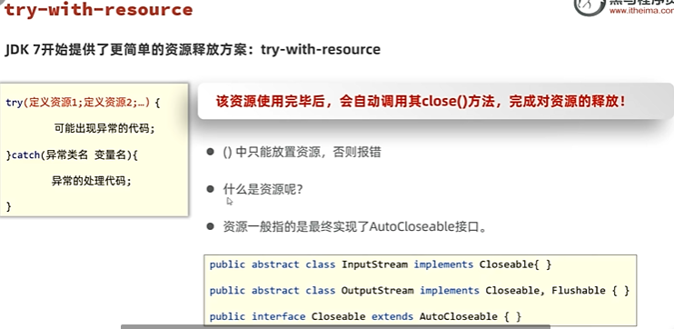


缓冲流：提高字符字节流流的速度，原理是更大的缓存池，默认是8k的缓存池

。。。

。。。

。。。

缓冲字符输入流

readLine():读取一行数据

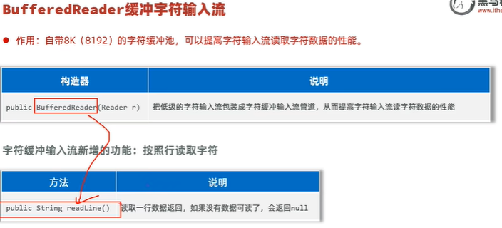

缓冲字符输出流

newLine():换行输出


### IO框架

common-io框架

引入依赖

```
<dependency>
    <groupId>commons-io</groupId>
    <artifactId>commons-io</artifactId>
    <version>2.11.0</version>
</dependency>
```

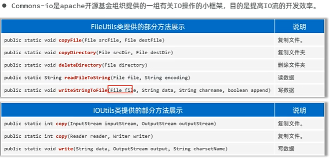

## 反射 

Tip：高级框架如Spring使用了反射的特性。

### 概念

加载类，并允许以编程的的方式解剖类的各种成分（成员，方法，构造器，实现接口等）。

### 使用

#### 反射第一步：获取class对象

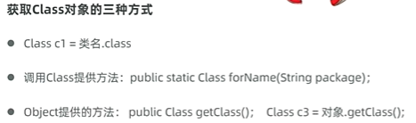

#### 获取构造器

获取构造器的目的是为了创建对象


#### 获取成员变量

获取成员变量的目的是为了取值，赋值


#### 成员方法

获取成员方法的目的是调用方法


#### 还可以：获取类/对象实现接口

```
对象.getClass().getInterfaces()
```

### 反射的作用

主要被用来做高级框架 


为什么可以破坏泛型的约束呢？

因为泛型的约束只在代码之间，而反射工作在运行时。

## 注解

### 概述

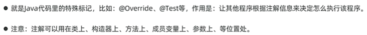

### 自定义注解

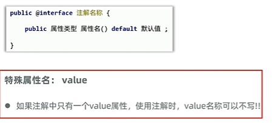

### 注解的原理

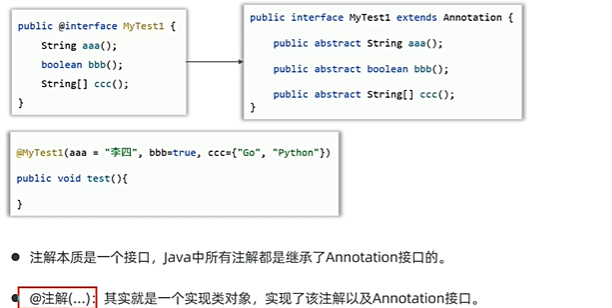

### 元注解

注解注解的注解（好玩）

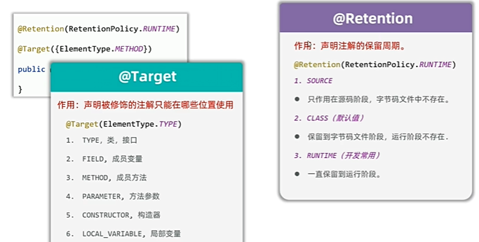

### 注解的解析

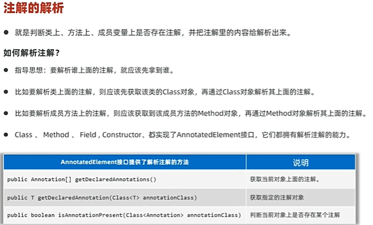

### 注解的使用场景

junit框架

## 动态代理  

### Tip

AOP切面编程用的就是动态代理思想。

JDK 动态代理只能为接口创建代理类，为对象实现动态代理，其必须实现接口。

为什么呢？

① Java 不支持多继承，而一个代理类可能需要代理 **多个接口的方法**。

② 继承类可能会破坏封装（private、final）

③ 目标类可能没有无参构造方法

### 概述

**动态代理（Dynamic Proxy）** 是指在 **运行时** 创建代理对象，并在方法调用时 **动态地拦截方法调用**、**添加自定义逻辑** 的机制。

### 如何创建？

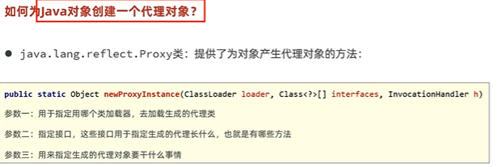

什么是类加载器：

类加载器（ClassLoader）**是一个负责加载类到JVM（Java虚拟机）中的组件。Java程序中的类并不是在程序启动时就加载到内存中的，而是当类首次被使用时，类加载器才会将它加载到JVM中。

## junit单元测试

基于注解

## Web.xml

### Servlet（Serve+Applet）

Servlet是运行在服务器上的 Java 类，用来**处理客户端请求（如 HTTP 请求）并生成响应（HTML、JSON 等）**。

自定义Servlet类需要继承HttpServlet类

在web.xml中使用<servlet>标签和<servlet-mapping>标签配置或者加注解配置

### 过滤器

自定义过滤器要实现Filter接口

在web.xml中使用<fliter>标签和<fliter-mapping>标签配置或者加@WebFilter注解配置

### 监听器

自定义监听器，根据需求，实现不同的Listener接口。


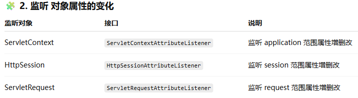

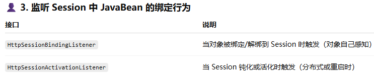

在web.xml中使用<listener>标签和<listener-mapping>标签配置或者加@WebListener注解配置

### jsp

模板形似html，但是其中可以写java代码，使用<% %>标签包裹的是脚本，其中可以写java语句，<%= %>其中可以包裹java中的变量以输出变量到页面。

先阶段使用JSTLjar包来满足在jsp中写java的需求。
