# MySQL

## MySQL介绍

MySQL属于关系型数据库。关系型数据库还有SQL Server, Oracle, MariaDB（MySQL创始人开发的底层逻辑与MySQL一致的数据路）, DB2数据库。

非关系型数据库：Redis,ES

##### MySQL的特性

MySQL区别于其它关系型数据库很大的一个特点就是支持插件式的存储引擎,支持如InnoDB, MyISAM, Memory等
目前google、腾讯、淘宝、百度、新浪、facebook等公司都在使用MySQL作为数据存储层方案
MySQL设计成C/S模型
MySQL的服务器模型采用的是I/O复用+可伸缩的线程池,是实现网络服务器的经典模型

## MySQL数据类型

MySQL数据类型定义了数据的大小范围, 因此使用时选择合适的类型, 不仅会降低表占用的磁盘空间, 间接减少了磁盘I/O的次数, 提高了表的访问效率, 而且索引的效率也和数据的类型息息相关。

### 数据类型

#### 数值类型

Tip：float，double在精度方面不适合做金融，和其他需要高精度的计算，在MySQL中应该使用Decimal字段，在java中应使用BigDecimal类。

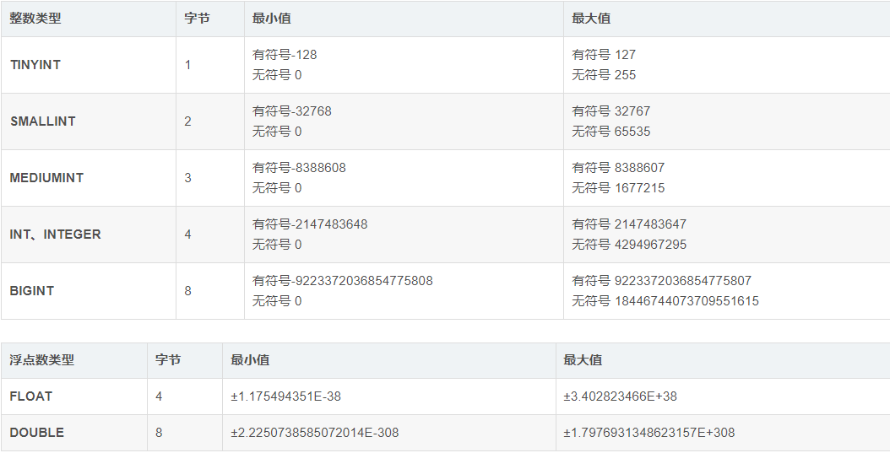

#### 字符串类型

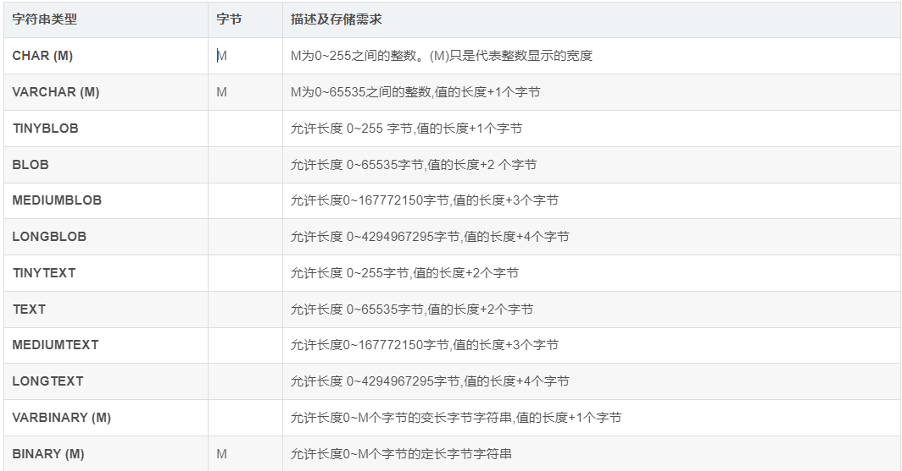

#### 日期和时间类型


#### 枚举类和SET

这两个类型,都是限制该字段只能取固定的值,但是枚举字段只能取一个唯一的值,而集合字段可以取任意个值。

**枚举类的应用**

```
-- 创建用户表      
CREATE TABLE `user` (
  `id` INT PRIMARY KEY AUTO_INCREMENT,
  `name` VARCHAR(50) NOT NULL,
  -- 枚举类型：性别（单选）
  `gender` ENUM('男', '女', '未知') DEFAULT '未知',
  `age` TINYINT UNSIGNED
);
```

**set的应用**

```
-- 创建文章表
CREATE TABLE `article` (
  `id` INT PRIMARY KEY AUTO_INCREMENT,
  `title` VARCHAR(100) NOT NULL,
  -- 集合类型：标签（多选）
  `tags` SET('技术', '编程', 'MySQL', 'Java') DEFAULT '',
  `content` TEXT
);
```


## MySQL运算符

Tip：运算时要注意，不要越界，精度也要考虑。

算术运算符

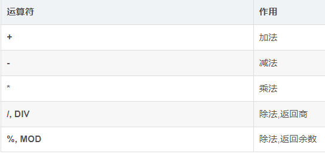

逻辑运算符


比较运算符

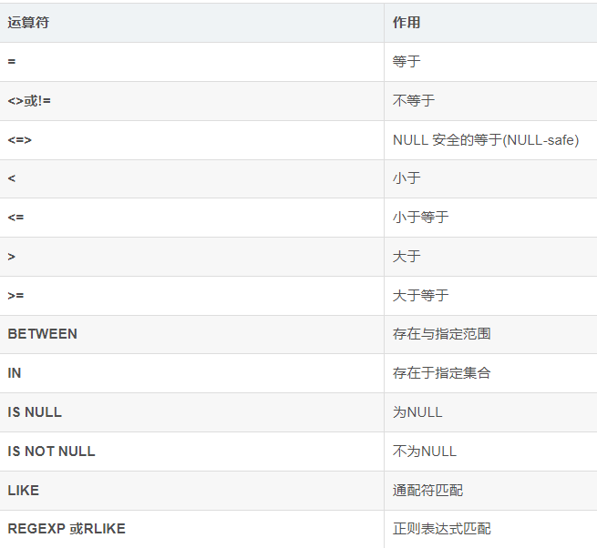

## MySQL的常用函数

### 时间和日期函数


### 字符串函数

```
--连接函数
SELECT CONCAT ()
--
SELECT INSTR ();
--统计长度
SELECT LENGTH();
```


### 聚合函数

**Tips**：只有SELECT子句和HAVING子句、ORDER BY子句中能够使用聚合函数。例如，在WHERE子句中使用聚合函数是错误的。

count sum min max avg

### 数学函数

```
(1) 绝对值函数：ABS(x) 用于返回 x 的绝对值

(2) 返回圆周率的函数：PI() PI() 返回圆周率值

(3) 平方根函数：SQRT(x) SQRT(x) 返回非负数 x 的二次方根

(4) 求余函数：MOD(x,y) MOD(x,y) 返回 x 被 y 除后的余数，MOD(x,y) 对于带有小数部分的数值也起作用，它 返回除法运算后的精确余数

(5) 获取整数的函数：CEIL(x) 、CEILING(x) 、FLOOR(x) CEIL(x) 用于返回不小于 x 的最小整数值

​	CEILING(x) 用于返回不小于 x 的最小整数

​	FLOOR(x) 返回不大于 x 的最大整数值

(6) 获取随机数的函数：RAND() 、RAND(x) RAND() 用于返回一个随机浮点值，范围在 0 ~ 1 之间

​	RAND(x) 用于返回一个随机浮点值，范围在 0~1 之间，x 被用作种子值，用来产生重复序列

(7) 四舍五入的函数：ROUND(x) 、ROUND(x,y) ROUND(x) 用于对 x 进行四舍五入

​	ROUND(x,y) 用于对 x 进行四舍五入，并保留小数点后 y 位

(8) 截取数值的函数：TRUNCATE(x,y) TRUNCATE(x,y) 用于对 x 进行截取，结果保留小数点后 y 位

(9) 符号函数：SIGN(x) SIGN(x) 用于返回参数 x 的符号，当 x 为负数时返回 -1 ，当 x 为正数时返回 1 ， 当 x 为 零时返回 0

(10) 幂运算函数：POW(x,y) 、POWER(x,y) 、EXP(x) POW(x,y) 用于返回 x 的 y 次方的结果

(11) 对数运算函数：LOG(x) 、LOG10(x) LOG(x) 返回 x 的自然对数

​	使用 LOG10(x) 计算以 10 为基数的对数

(12) 角度与弧度相互转换的函数：RADIANS(x) 、DEGREES(x) RADIANS(x) 用于将参数 x 由角度转化为弧度

​	DEGREES(x) 用于将参数 x 由弧度转化为角度

(13) 正弦函数和反正弦函数：SIN(x) 、ASIN(x) SIN(x) 用于返回 x 的正弦值，其中 x 为弧度值

​	ASIN(x) 用于返回 x 的反正弦，即正弦为 x 的值

(14) 余弦函数和反余弦函数：COS(x) 、ACOS(x) COS(x) 用于返回 x 的余弦，其中 x 为弧度值

​	ACOS(x) 用于返回 x 的反余弦，即余弦是 x 的值

(15) 正切函数、反正切函数、余切函数：TAN(x) 、ATAN(x) 、COT(x) TAN(x) 返回 x 的正切，其中 x 为给定的弧 度值

​	ATAN(x) 用于返回 x 的反正切，即正切为 x 的值

​	COT(x) 用于返回 x 的余切

```


## MySQL完整性约束

### 主键约束----->主键索引

primary key：不能为空 不能重复  存在联合主键       //  InnoDB引擎要求一定要有主键约束，即使不指定也会自动生成。

### 自增键约束

auto_increment：自增，只能用于整数类型的字段，下一条数据默认+1

### 唯一键约束----->唯一键索引

unique：不能重复

### 非空约束

not null：不能为空

### 默认约束

default：给字段一个默认值

### 外键约束

foreign key：外键

### 案例

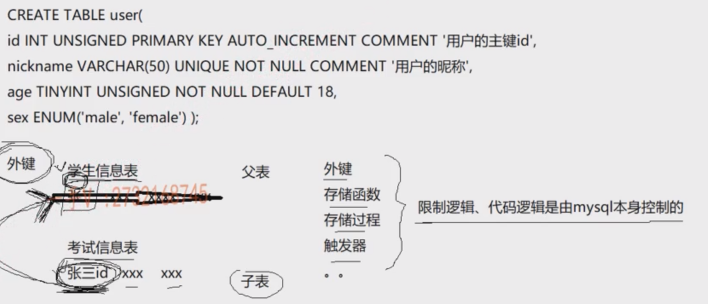

tip：现在的开发中，由于MySQL的性能问题，外键，存储函数，存储过程，触发器这些逻辑由后端业务控制。

因为后端业务大多发生在内存中 内存速度很快 而MySQL经常要有磁盘的IO，速度很慢。

## 关系型数据库表设计

tip：

一对一 / 一对多 / 多对多，说的是**实体实例（也就是两边表里的一条条记录/行）之间的“基数”关系**，而不是“整张表对整张表”的关系。

一对一：用户表和用户信息表 用户表中的一条数据在用户信息表中对应的只有一条。

一对多：作者表和书籍表，作者有多本书，书籍表中有多条数据与一个作者对应。

多对多：学生表和课程表，学生可以选多门课，一门课有很多学生选，多对多对应。

### 一对一：子表增加一列 关联父表的主键或唯一键

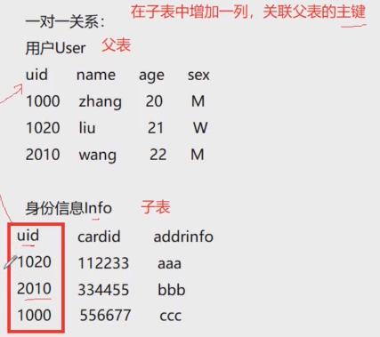

### 一对多：子表增加一列 关联父表的主键或唯一键

图中 用户表的uid与订单表有一对多的关系

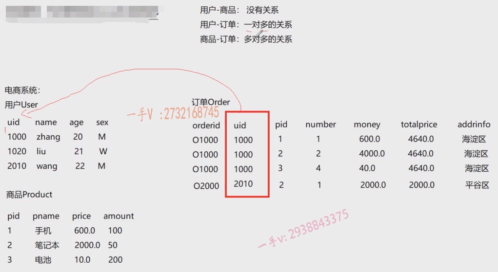

### 多对多：增加一个中间表

## 关系型数据库范式

Tip:数据库表的范式类似于代码的解耦。好比说把一张囊括了很多内容的表分割成课程表 学生表 教师表

应用数据库范式可以带来许多好处,但是最重要的好处归结为三点:

1.减少数据冗余(这是最主要的好处,其他好处都是由此而附带的)
2.消除异常(插入异常,更新异常,删除异常)
3.让数据组织的更加和谐
但是数据库范式绝对不是越高越好,范式越高,意味着表越多,多表联合查询的机率就越大,SQL的效率就变低。

### 第一范式

#### 概念

第一范式(1NF)是指数据库表的每一列都是不可分割的基本数据线；也就是说：每列的值具有原子性，不可再分割。

Tip：元组：一条（行）数据的概念。属性：列的概念。 

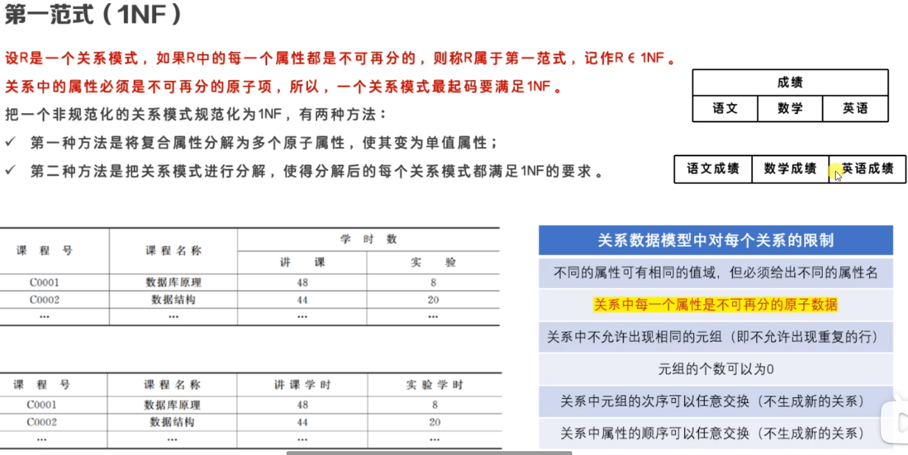

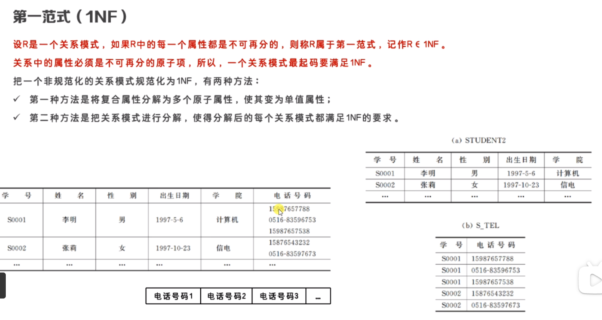

### 第二范式

#### 概念

第二范式(2NF)是在第一范式(1NF)的基础上建立起来得，满足第二范式(2NF)必须先满足第一范式(1NF)。如果表是单主键，那么主键以外的列必须完全依赖于主键；如果表是复合主键，那么主键以外的列必须完全依赖于主键，不能仅依赖主键的一部分。

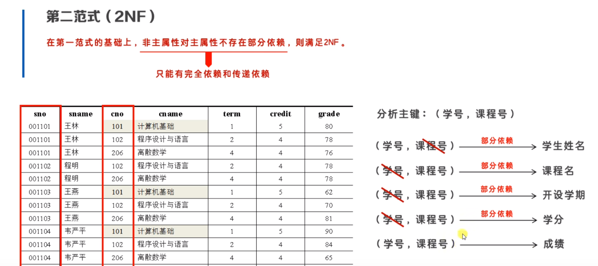

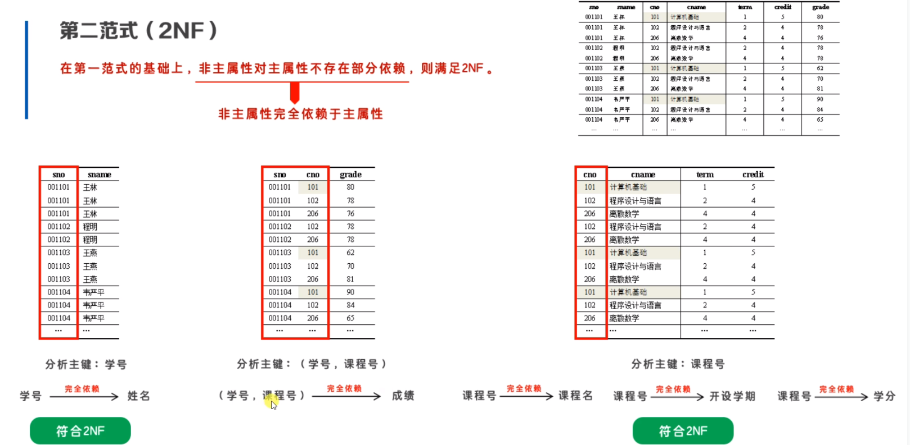

### 第三范式

#### 概念

第三范式(3NF)是在第二范式的基础上建立起来的，即满足第三范式必须要先满足第二范式。第三范式(3NF)要求：表中的非主键列必须和主键直接相关而不能间接相关；也就是说：非主键列之间不能相关依赖。

传递依赖：即两个非主属性相互完全依赖


## Mysql使用命令

### 登录

```
mysql -u root -p password    //root用户带密钥登录
mysql -u root -p password -h 域名 -P port   //远程连接
```

**常用选项**

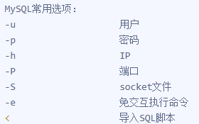

### 管理用户

#### 查看用户

```
//默认有3个用户 一个root用户，两个系统内置用户，两个系统内置用户用户内部操作，默认被锁定
mysql> select user,host from mysql.user;
+---------------+-----------+
| user          | host      |
+---------------+-----------+
| mysql.session | localhost |
| mysql.sys     | localhost |
| root          | localhost |
+---------------+-----------+
3 rows in set (0.00 sec)
```

#### 创建用户

```
CREATE USER [IF NOT EXISTS] '用户名'@'主机名' IDENTIFIED BY '密码';
```

**示例**

```
//仅允许本地登录
mysql> create user if not exists xiaozhi@localhost identified by '1968zhss';
Query OK, 0 rows affected (0.00 sec)

//仅允许8.138.19网段登录 %表示任意
mysql> create user if not exists xiaozhi@'8.138.19.%' identified by '1968zhss';
Query OK, 0 rows affected (2.25 sec)
```

**Tips**：mysql无法同时设置多个不同特征的主机名 如不能同时设置localhost和8.139.19网段，不符合mysql的设计理念，如若一定要设置多个主机登录，如下：

```
CREATE USER  
'xiaozhi'@'localhost' IDENTIFIED BY '你的密码',  
'xiaozhi'@'8.12.12.%' IDENTIFIED BY '你的密码';
```


#### 授权

```
GRANT [权限类型] ON [数据库名.表名] TO [用户名@主机名]
```

**示例**

```
grant all on tlias.* to xiaozhi@localhost; //授予用户xiaozhi tlias数据库的所有权限
注：此时xiaozhi仅仅能操作tlias数据库，而没有创建，操作其他数据库的权限
```

#### 查看用户授权

```
SHOW GRANTS FOR [用户名]@[主机名]
```

```
mysql> show grants for xiaozhi@localhost;
+------------------------------------------------------------+
| Grants for xiaozhi@localhost                               |
+------------------------------------------------------------+
| GRANT USAGE ON *.* TO 'xiaozhi'@'localhost'                |
| GRANT ALL PRIVILEGES ON `tlias`.* TO 'xiaozhi'@'localhost' |
+------------------------------------------------------------+
2 rows in set (0.00 sec)

//usage表示无实际权限
```

#### 撤权

```
REVOKE [权限] ON [数据库名.表名] from [用户名@主机]；
```

**示例**

```
revoke delete on tlias from xiaozhi@localhost；//撤销用户xiaozhi对tlias所有表的删除权
```

#### 删除用户

```
DROP USER [用户名@主机名]；
```

## MySQL核心SQL

### SQL语句

#### DQL

查询语句

#### DDL


#### DML


#### DCL


grant：授权

revoke：撤权

#### TCL

事物控制语言

开启事物：start transaction

事物提交：commit

事物回滚： rollback

### CRUD专题

在频繁执行增删改查操作时，可以创建一个连接池，避免MySQL Serve频繁的与MySQL Client三次握手，再断开连接，浪费资源。

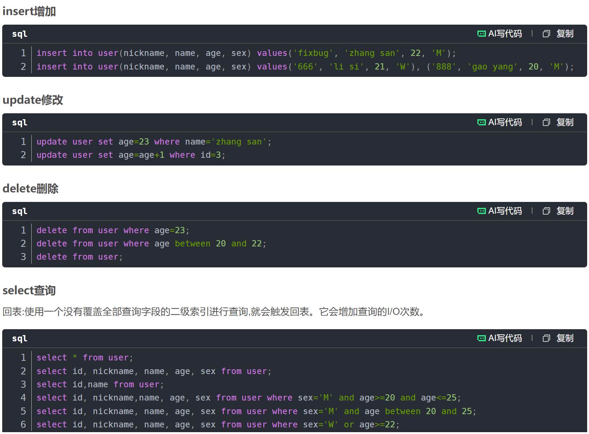

select通用语法

```
select {字段列表} from <表1>,<表2> [where 表达式] [group by] [having] [order by] [limit <>]
```

### 一些关键字

#### distinct：字段去重

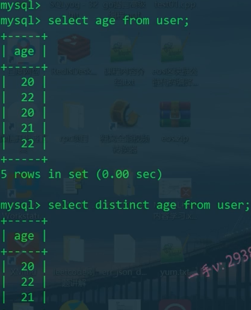

#### Null：空值查询

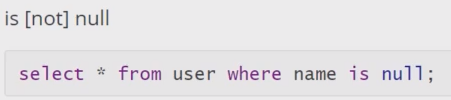

#### union：合并查询结果

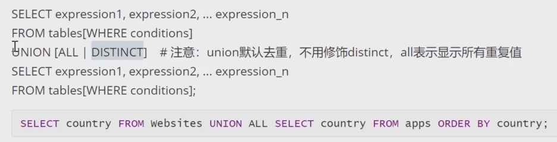

#### 带in查询

in 和not in

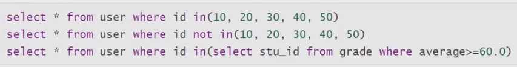

#### between...and...范围查询

```
select * from student where age between 15 and 18;
```

#### like查询

##### 普通字符串查询

```
select * from student where sname like 'wang';
```

##### 含有%通配的字符串

```
select * from student where sname like 'li%';
//查询姓名以li开头的记录
select * from student where sname like '%g';
//查询姓名以g结尾的记录
```

##### 下划线

单个下划线通配符只匹配单个字符，如果要匹配多个字符，需要连续使用多个下划线通配符。例如，字符串“ab_”匹配以字符串“ab”开始长度为3的字符串，如abc、abp等等；字符串“a__d”匹配在字符“a”和“d”之间包含两个字符的字符串，如"abcd"、"atud"等等。

```
select * from student where sname like 'zx__';
//查询姓名以zx开头且长度为4的记录
```

#### EXISTS

EXISTS关键字后面的参数可以是任意一个子查询， 它不产生任何数据只返回TRUE或FALSE。当返回值为TRUE时外层查询才会执行。

```
select * from class where exists (select * from student where sname='王五');
```

#### ANY

ANY关键字表示满足其中任意一个条件就返回一个结果作为外层查询条件。

```
select * from class where cid > any (select classid from student);
```

#### ALL

ALL关键字与ANY有点类似，只不过带ALL关键字的子査询返回的结果需同时满足所有内层査询条件。

```
select * from class where cid > all (select classid from student);
```

#### limit：分页查询

**格式**


**案例**

//第一条：查询前10条数据

//第二条：查询2000条之后的10条数据

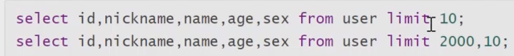

这是一个进行sql查询优化的案例 通过使用where字段使用加了索引的字段 加速查询。在写sql语句时 尽量与带了索引的字段相关联。

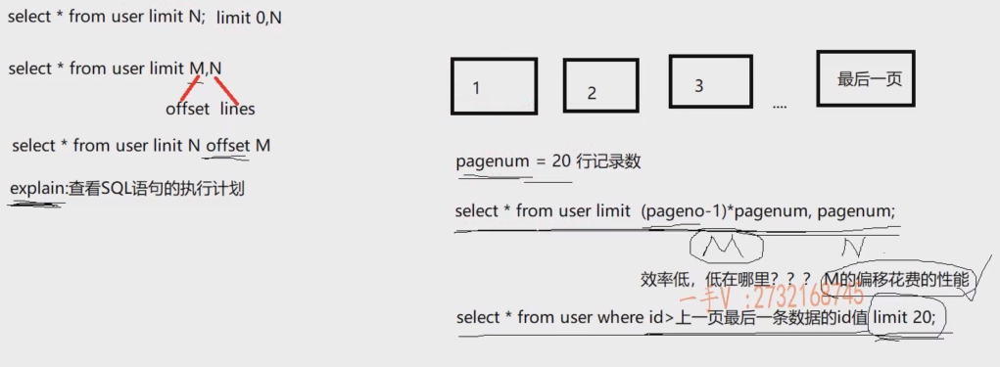

#### explain

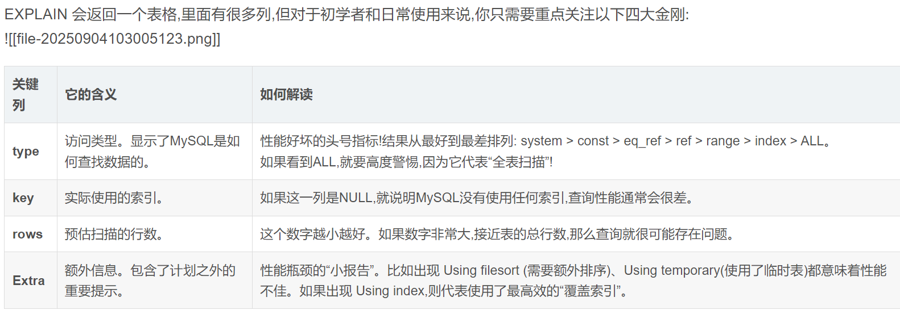

#### order by：排序

tip：在使用order by做查询时，select的字段和order by都是建立索引的字段 索引才会生效。

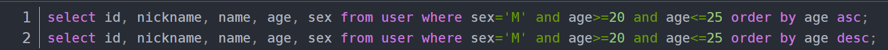

#### group by：分组

tip：使用group by时，select的字段必须与group by的字段有关 常常与聚合函数一起使用。

​         如果要对分组的数据进行筛选，若加在group by之前 使用where 若之后，使用having关键字。

​         在使用group by时，group by后的值也可以使用到索引。

​         使用group by时，select *无意义，因为只会列出group by字段限制的数据中的一条。

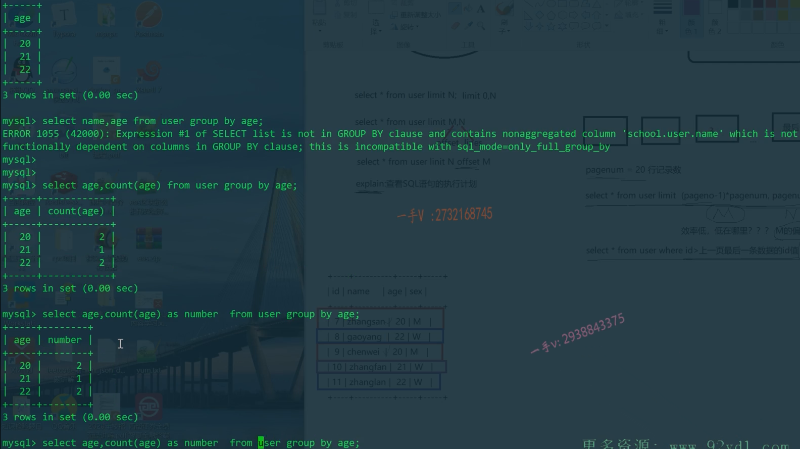

group by后加多个字段，按照多字段进行分组

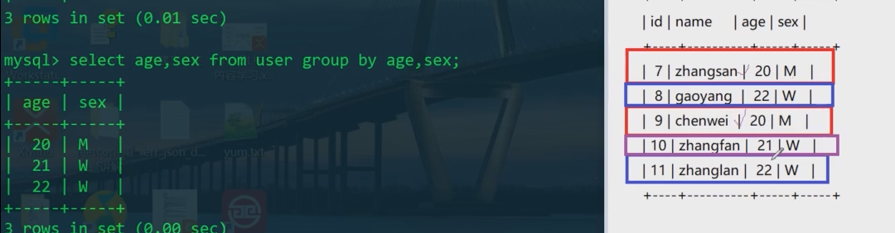

### 连接查询

Tip：

​	做多表查询时 比如三表 第一张表必须是与其余表都有关系的表，然后使用left join字段，根据on字段连接其他表

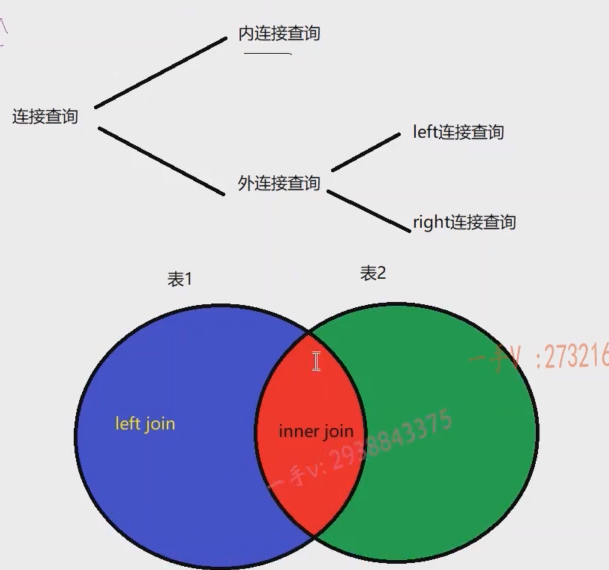

#### 内连接

select * from stu join sc；

结果是两张表的笛卡尔积

#### 外连接

**左连接**

select * from stu left join sc on 条件；

根据条件匹配。但是stu的每一行数据最少出现一次，匹配不到sc表的值，则为null。

**右连接**

同左连接

### 库操作

select database：查询当前使用的数据库

show databases：列出所有数据库

create database db：创建数据库db


use db：使用db数据库

删除数据库：drop db；

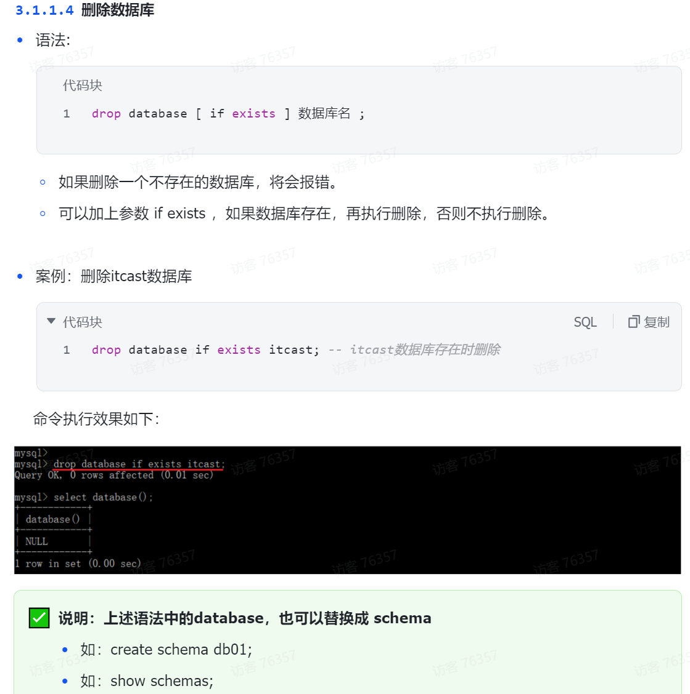

### 表操作

#### 列出当前使用数据库下所有表

```
show tables；
```

#### 建表

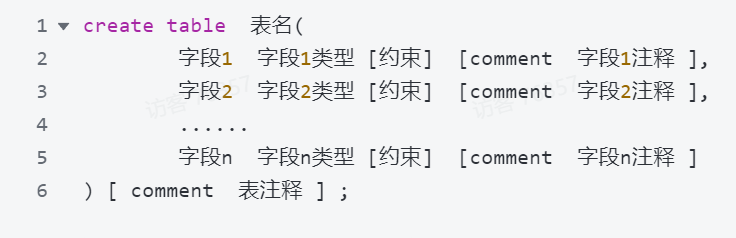

#### 查看表结构

```
desc A;    //查看A表结构
```

#### 查看建表sql

```
show create table A;   //查看A表的建表sql语句
```

#### 添加字段

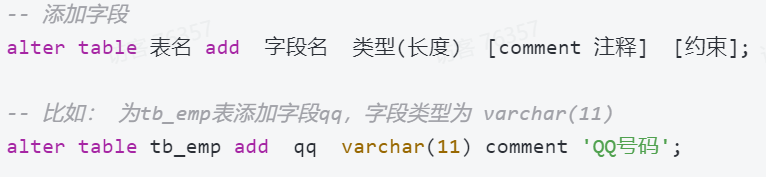

#### 修改字段

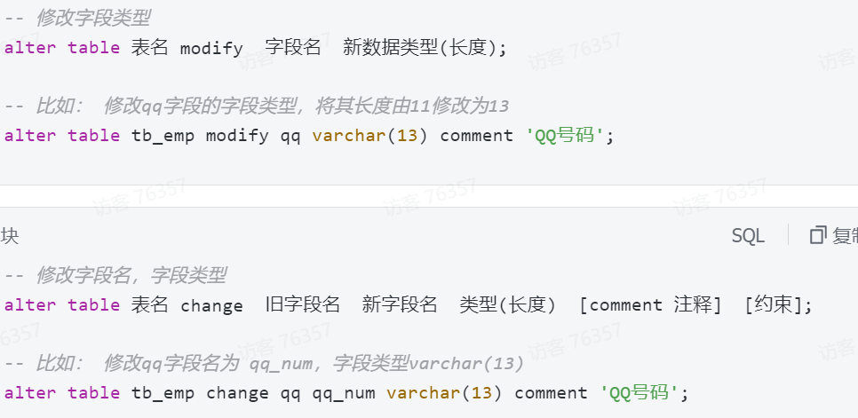

#### 删除字段

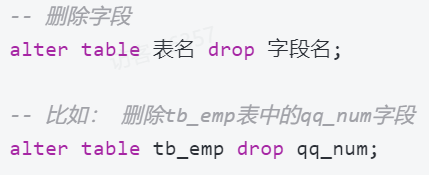

#### 修改表名

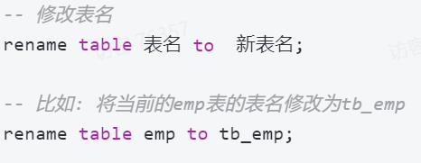

#### 删除表


## 优化手段

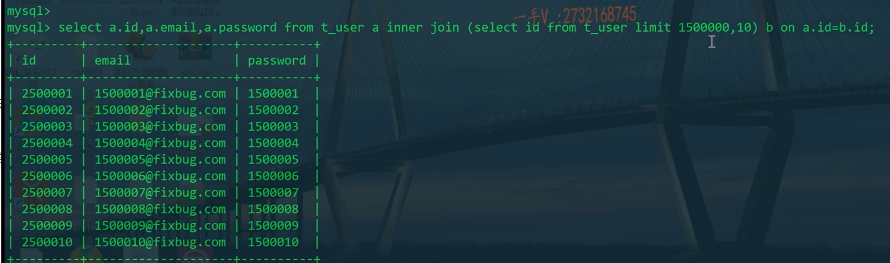

id自带索引 所以临时表b查的比较快，然后根据这张小表b中的id来查 。

## MySQL存储引擎

**Tip**：现如今，InnoDB的使用率远超过其他引擎。

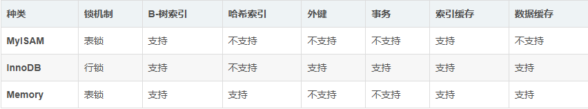

**锁机制**: 表示数据库在并发请求访问的时候,多个事务在操作时,并发操作的粒度。
**B-树索引和哈希索引**: 加速SQL的查询速度。
**外键**: 子表的字段依赖父表的主键,设置两张表的依赖关系。
**事务**: 多个SQL语句,保证它们共同执行的原子操作,要么成功,要么失败,不能只成功一部分,失败需要回滚事务。
**索引缓存和数据缓存**: 和MySQL Server的查询缓存相关,在没有对数据和索引做修改之前,重复查询可以不用进行磁盘I/O(数据库的性能提升,目的是为了减少磁盘I/O操作来提升数据库访问效率),读取上一次内存中查询的缓存就可以了。

## MySQL索引

### 原理

索引是 MySQL 中**提高查询效率的核心数据结构**，本质是**对表中一列或多列的值进行排序的特殊数据结构**，其核心目标是**将 “全表扫描” 的线性查找（O (n)）转化为高效的索引查找（如二叉树的 O (log n)、哈希的 O (1)）**，从而大幅减少数据库需要扫描的数据量。

由于索引也是需要存储成索引文件的,因此对索引的使用也会涉及磁盘I/O操作。如果索引创建过多,使用不当,会造成SQL查询时,进行大量无用的磁盘I/O操作,降低了SQL的查询效率,适得其反,因此掌握良好的索引创建原则非常重要!

#### 1. 索引的本质：空间换时间

- **代价**：索引需要额外的磁盘空间存储，且表数据更新（插入、删除、修改）时，索引也需同步更新，会增加写操作的开销。
- **收益**：查询时通过索引快速定位数据行，避免全表扫描，查询效率提升 10 倍甚至 100 倍以上。

#### 2. 核心实现：B + 树（MySQL 主流存储引擎 InnoDB 的默认索引结构）

MySQL 中 InnoDB 引擎的索引基于**B + 树**实现（MyISAM 也用 B + 树，仅细节不同），这是因为 B + 树相比二叉查找树、红黑树、B 树更适合磁盘存储的特性（磁盘 IO 是数据库性能的核心瓶颈）。

##### （1）B + 树的结构特点

B + 树是一种**平衡多路查找树**，其结构分为**叶子节点**和**非叶子节点**：

- **非叶子节点**：仅存储**索引键值**和**指向子节点的指针**，不存储实际数据行，目的是让非叶子节点尽可能小，减少磁盘 IO 次数（一次 IO 可加载更多节点）。
- **叶子节点**
  - 存储**索引键值**和**实际数据行的指针（MyISAM）** 或**直接存储数据行（InnoDB 的聚簇索引）**。
  - 所有叶子节点通过**双向链表**连接，按索引键值有序排列，支持范围查询（如`WHERE id BETWEEN 10 AND 20`）。
- **平衡特性**：B + 树的所有叶子节点在同一层，保证查询的时间复杂度稳定在 O (log n)（n 为数据量）。

##### （2）B + 树的查询过程（以 InnoDB 的主键索引为例）

假设表`user`的主键为`id`，数据量为 100 万，B + 树的高度为 3（根节点→中间节点→叶子节点）：

1. 数据库从**根节点**开始，根据查询的`id`值，找到对应的中间节点指针。
2. 加载**中间节点**，再次根据`id`值找到对应的叶子节点指针。
3. 加载叶子节点，在叶子节点的双向链表中找到目标id对应的数行。整个过程仅需3次磁盘 IO，而全表扫描可能需要数百次甚至数千次 IO。

##### （3）为什么不用哈希表 / 红黑树？

- **哈希表**：适合等值查询（如`id=100`），但不支持范围查询（如`id>100`），且哈希冲突会降低效率，因此仅在 Memory 引擎中作为辅助索引。
- **红黑树**：是二叉树，高度会随数据量增大而变高（如 100 万数据需约 20 层），导致磁盘 IO 次数过多，效率远低于 B + 树。

### 索引分类

1. 普通索引: 没有任何限制条件,可以给任何类型的字段创建普通索引(创建新表&已创建表,数量是不限的,一张表的一次sql查询只能用一个索引 where a=1 and b='M')
2. 唯一性索引: 使用UNIQUE修饰的字段,值不能够重复,主键索引就隶属于唯一性索引
3. 主键索引: 使用Primary Key修饰的字段会自动创建索引(MyISAM, InnoDB)
4. 单列索引: 在一个字段上创建索引
5. 多列索引: 在表的多个字段上创建索引 (uid+cid, 多列索引必须使用到第一个列,才能用到多列索引,否则索引用不上)
6. 全文索引: 使用FULLTEXT参数可以设置全文索引,只支持CHAR,VARCHAR和TEXT类型的字段上,常用于数据量较大的字符串类型上,可以提高查询速度(线上项目支持专门的搜索功能,给后台服务器增加专门的搜索引擎支持快速高校的搜索 elasticsearch 简称es C++开源的搜索引擎 搜狗的workflow)

## MySQL事务

### 概念

一个事务是由一条或者多条对数据库操作的SQL语句所组成的一个不可分割的单元,只有当事务中的所有操作都正常执行完了,整个事务才会被（commit）提交给数据库;如果有部分事务处理失败,那么事务就要回退（rollback）到最初的状态,因此,事务要么全部执行成功,要么全部失败。

### ACID

事务必须满足：

事务的原子性(Atomic):
事务是一个不可分割的整体,事务必须具有原子特性,及当数据修改时,要么全执行,要么全不执行,即不允许事务部分的完成。
事务的一致性(Consistency):
一个事务执行之前和执行之后,数据库数据必须保持一致性状态。数据库的一致性状态必须由用户来负责,由并发控制机制实现。就拿网上购物来说,你只有让商品出库,又让商品进入顾客的购物车才能构成一个完整的事务。
事务的隔离性(Isolation):
当两个或者多个事务并发执行时,为了保证数据的安全性,将一个事物内部的操作与其它事务的操作隔离开来,不被其它正在执行的事务所看到,使得并发执行的各个事务之间不能互相影响。
事务的持久性(Durability):
事务完成(commit)以后,DBMS保证它对数据库中的数据的修改是永久性的,即使数据库因为故障出错,也应该能够恢复数据!

### 事务的保存点

```
1. SAVEPOINT 保存点名称;//标记保存点
2. ROLLBACK TO [SAVEPOINT] 保存点名称;//回滚到某一个保存点
3. RELEASE SAVEPOINT 保存点名称;//删除保存点
```

### 事务并发存在的问题

事务处理不经隔离,并发执行事务时通常会发生以下的问题:

**脏读(Dirty Read)**: 一个事务读取了另一个事务未提交的数据。例如当事务A和事务B并发执行时,当事务A更新后,事务B查询读取到A尚未提交的数据,此时事务A回滚,则事务B读到的数据就是无效的脏数据。(事务B读取了事务A尚未提交的数据)
**不可重复读(NonRepeatable Read)**: 一个事务的操作导致另一个事务前后两次读取到不同的数据。例如当事务A和事务B并发执行时,当事务B查询读取数据后,事务A更新操作更改事务B查询到的数据,此时事务B再次去读该数据,发现前后两次读的数据不一样。(事务B读取了事务A已提交的数据)
**虚读(Phantom Read)/幻读:** 一个事务的操作导致另一个事务前后两次查询的结果数据量不同。例如当事务A和事务B并发执行时,当事务B查询读取数据后,事务A新增或者删除了一条满足事务B查询条件的记录,此时事务B再去查询,发现查询到前一次不存在的记录,或者前一次查询的一些记录不见了。(事务B读取了事务A新增加的数据或者读不到事务A删除的数据)

### 事务的隔离级别

### MySQL的事务处理命令

## MySQL中常用可执行文件

### MySQLDUMP—数据库备份

#### 备份数据库

```
mysqldump -u [username] -p[password] [database_name] > [filename].sql
```

#### 备份表

```
mysqldump -uroot -p pai_coding article > article.sql
```

### MySQLadmin—数据库管理工具

可以用来执行一些管理操作，比如说创建数据库、删除数据库、查看 MySQL 服务器的状态等。

在自动化脚本中，会经常使用 mysqladmin 来执行一些管理操作。

查看服务器状态

```
mysqladmin -uroot -p status
```

重新加载授权表

```
mysqladmin -uroot -p flush-privileges
mysqladmin -uroot -p reload
```

刷新日志文件

```
mysqladmin -uroot -p flush-logs
```

......

### MySQLcheck

mysqlcheck 是 MySQL 提供的一个命令行工具，用于检查、修复、分析和优化数据库表，对数据库的维护和性能优化非常有用。

检查数据库所有的表

```
mysqlcheck -uroot -p --check database_name
```

### MySQLimport

导入外部文件至mysql的工具

### MySQLshow

查看数据库信息的工具，可查看数据库中的表，列，索引等等。

### MySQLbinlog

mysqlbinlog 用于查看 MySQL 二进制日志文件的内容，可以用于恢复数据、查看数据变更等。二进制日志是 MySQL 服务器的一个重要特性，记录了数据库更改的所有“事件”，如表的创建、数据的插入、更新和删除操作。

如果发生数据丢失或损坏，就可以使用 mysqlbinlog 来查看和恢复自上次备份以来执行的更改。
