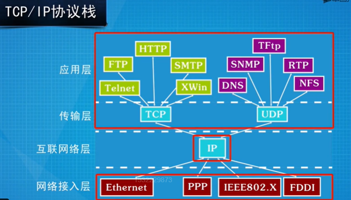
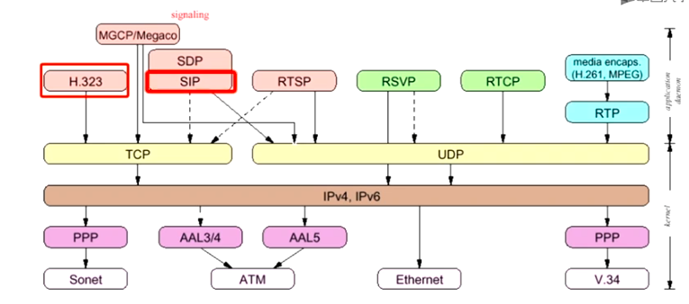

# 计算机网络

## 体系





## 网络模型

### OSI七层网络模型

**物理层（Physical Layer）**
 负责传输原始比特流，通过物理媒介（如电缆、光纤）进行数据的传输。物理层定义了硬件设备、连接方式、电压、信号等规范。

**数据链路层（Data Link Layer）**------------>以太网，以太网只能在局域网中发挥作用。
 负责在物理层之上提供错误检测和纠正，确保数据在同一网络中的可靠传输。它将数据封装成帧（Frame）并通过MAC地址来传输。

**网络层（Network Layer）**------------->ip协议
 负责数据包从源到目的地的传输，包括路由选择、寻址等功能。IP协议就是运行在这一层，负责给数据包分配IP地址。

**传输层（Transport Layer）**
 负责端到端的数据传输，包括流量控制、错误检测、数据分段和重组。TCP和UDP协议是工作在传输层。

**会话层（Session Layer）**
 负责建立、管理和终止会话（连接），使得不同系统之间可以进行数据交换，并支持会话的恢复。

**表示层（Presentation Layer）**
 负责数据的格式转换、加密和解密、数据压缩等功能，确保不同系统能够理解对方的数据格式。

**应用层（Application Layer）**
 为用户提供具体的网络服务和应用，直接与用户交互。常见的协议有HTTP、FTP、SMTP等。

###  四层模型（TCP/IP模型）

TCP/IP模型是一个简化的网络模型，用来描述和规范互联网中的协议栈。它将网络通信分为四个层次：

1. **网络接口层（Network Interface Layer）**
    相当于OSI模型中的物理层和数据链路层，负责在物理网络上传输数据。
2. **互联网层（Internet Layer）**
    对应于OSI的网络层，主要负责IP寻址、路由和数据包传输。最常见的协议是IP协议。
3. **传输层（Transport Layer）**
    对应于OSI的传输层，主要负责端到端的数据传输，最常见的协议是TCP和UDP。
4. **应用层（Application Layer）**
    对应于OSI的应用层、表示层和会话层，提供网络服务和应用，如HTTP、FTP、SMTP等。

## IP精讲

### 地址类别

🅰️ A类地址

- **范围**：`1.0.0.0` ～ `126.255.255.255`
- **网络号长度**：8 位
- **主机号长度**：24 位
- **默认子网掩码**：`255.0.0.0`
- **可用网络数**：126 个（0 和 127 保留）

A类用于**超大型网络**，例如早期的互联网骨干机构。

🅱️ B类地址

- **范围**：`128.0.0.0` ～ `191.255.255.255`
- **网络号长度**：16 位
- **主机号长度**：16 位
- **默认子网掩码**：`255.255.0.0`
- **可用网络数**：16,384 个
- **每个网络可用主机数**：约 6.5 万台

B类用于**中型网络**，如大学或大型企业。

 🅲️ C类地址

- **范围**：`192.0.0.0` ～ `223.255.255.255`
- **网络号长度**：24 位
- **主机号长度**：8 位
- **默认子网掩码**：`255.255.255.0`
- **可用网络数**：约 200 万个
- **每个网络可用主机数**：254 台

C类用于**小型局域网（LAN）**，如中小企业或家庭网络。

 🅳 D类地址（多播地址）

- **范围**：`224.0.0.0` ～ `239.255.255.255`
- **特点**：不分网络号和主机号，用于**组播（Multicast）通信**，即一个发送者对多个接收者。
- 例如：`224.0.0.1` 表示“本地子网内所有主机”。

 🅴 E类地址（保留实验）

- **范围**：`240.0.0.0` ～ `255.255.255.255`
- **特点**：保留用于**科研与实验用途**，不用于普通网络通信。

📘 补充：特殊地址

| 地址                             | 说明                                                         |
| -------------------------------- | ------------------------------------------------------------ |
| `0.0.0.0`                        | 当前主机（本机）地址或默认路由                               |
| `127.0.0.1` ～ `127.255.255.255` | 回环地址（Loopback），常用 `127.0.0.1` 表示本地测试          |
| `255.255.255.255`                | 广播地址                                                     |
| 私有地址（不可在公网使用）       | A类：`10.0.0.0/8`   B类：`172.16.0.0/12`   C类：`192.168.0.0/16` |

###  一条信息从源主机传递到目标主机的过程如下：

1.**源主机判断目标位置**
 源主机根据目标主机的 **IP 地址** 和自己的 **子网掩码**，判断目标是否在同一子网。

- 如果在同一子网内：可以直接通信；
- 如果不在同一子网：必须通过**默认网关（路由器）**转发。

------

2.**源主机确定下一跳的 MAC 地址**
 源主机查自己的 ARP 缓存：

- 若目标在同一子网，则通过 ARP 查到 **目标主机的 MAC 地址**；
- 若目标在不同子网，则通过 ARP 查到 **默认网关的 MAC 地址**。

然后源主机用：

```
源IP = 自己IP
目的IP = 目标主机IP
源MAC = 自己的MAC
目的MAC = 下一跳设备的MAC（可能是路由器）
```

来封装帧。

------

3.**路由器逐跳转发**
 路由器收到帧后：

- 拆掉旧的帧头（MAC 信息）；

- 检查 IP 地址，看数据包该往哪个子网走；

- TTL–1，重新计算 IP 校验和；

- 查路由表确定下一跳；

- 重新封装新的帧头：

  ```
  源MAC = 当前路由器接口的MAC
  目的MAC = 下一跳设备的MAC
  ```

发送到下一个链路。

💡 **此时路由器不改 IP 地址，只改 MAC 地址。**

------

4.**数据包到达目标子网**
 当数据包到达目标子网的最后一个路由器时：

- 路由器通过 ARP 解析出目标主机的 MAC 地址；
- 用该 MAC 地址封装帧；
- 把帧交给交换机；
- 交换机根据 MAC 地址表找到目标主机的端口；
- 数据帧被送达目标主机。

------

5.**目标主机接收数据**
 目标主机收到帧后：

- 检查目的 MAC 是否是自己；
- 解封装链路层帧 → 网络层 IP；
- 检查目的 IP 是否匹配；
- 若匹配，则上交给上层协议（TCP/UDP）。


NAT:公有ip地址与私人地址的转换器，用来应对ipv4地址的枯竭。

PAT：将私有ip映射到公有ip的不同端口

## 传输层协议

HTTP：80端口

HTTPS：443端口

FTP：20 21端口（两条TCP连接，一条控制连接，一条传输数据）

SSH：22端口


当使用一个服务时：

1）客户端随机挑一个端口（比如 50321）

2）连接服务器的固定端口（比如 443）

3）服务器通过同一个连接把数据返回给客户端

