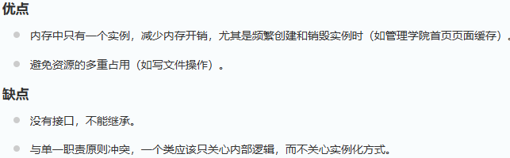

# 设计模式

## 工厂模式

### 概念

工厂模式适用于生成复杂对象的场景。其提供了一种创建对象的方式，使得创建对象的过程与使用对象的过程分离。将创建对象的逻辑封装在一个工厂类中，提高代码的可维护性和可扩展性。

### 类型

简单工厂模式

工厂方法模式

抽象工厂模式

## 单例模式

### 概念

这种模式涉及到一个单一的类，该类负责创建自己的对象，同时确保只有单个对象被创建。这个类提供了一种访问其唯一的对象的方式，可以直接访问，不需要实例化该类的对象。

单例模式是一种创建型设计模式，它确保一个类只有一个实例，并提供了一个全局访问点来访问该实例。

### 设计思路

将构造函数设为私有。

在类中声明静态的类的实例对象。

设计一个暴露给外部的获取这个实例对象的方法。

### 实现方式

#### 懒汉式

```
//加锁保证线程安全
public class Singleton {  
    private volatile static Singleton singleton;  
    private Singleton (){}  
    public static Singleton getSingleton() {  
    if (singleton == null) {  
        synchronized (Singleton.class) {  
            if (singleton == null) {  
                singleton = new Singleton();  
            }  
        }  
    }  
    return singleton;  
    }  
}
```

#### 饿汉式（或者在类中直接创建实例对象）

```
//缺点是类加载时就会创建对象，浪费内存
public class Singleton {  
    private static Singleton instance = new Singleton();  
    private Singleton (){}  
    public static Singleton getInstance() {  
    return instance;  
    }  
}
```

#### 双检锁

#### 登记式（静态内部类）

#### 枚举

```
public enum Singleton {  
    INSTANCE;  
    public void whateverMethod() {  
    }  
}
```


### 应用场景


### 优缺点



## 建造者模式

### 概念

建造者模式是一种创建型设计模式，它的主要目的是将一个复杂对象的构建过程与其表示相分离，从而可以创建具有不同表示形式的对象。